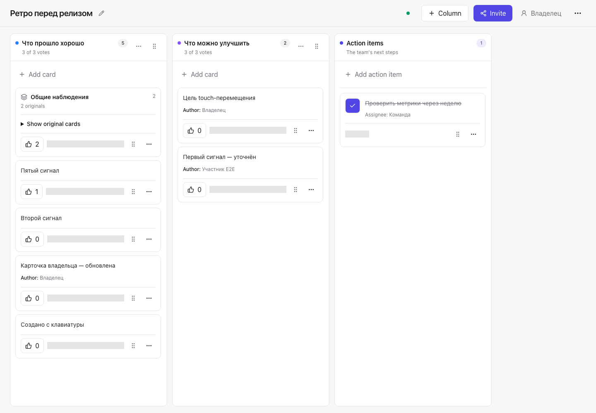

[English](README.md) | [Русский](README.ru.md) | [Español](README.es.md)

# Badaction

Badaction es un tablero de retrospectivas ligero, autohospedado y de código
abierto para equipos. No requiere cuentas de usuario: el acceso se vincula a
una sesión anónima del navegador y a una membresía del tablero.

La interfaz de la aplicación está actualmente en ruso; la documentación del
proyecto está disponible en inglés, ruso y español.



## Funcionalidades

- Crear un tablero sin registrar una cuenta.
- Volver desde la página principal a los tableros propios y compartidos activos
  en el mismo navegador.
- Invitar participantes mediante enlaces que caducan y tienen un número de usos
  limitado.
- Separar los permisos de propietario y participante.
- Crear, renombrar, reordenar y eliminar hasta diez columnas con límites de voto
  por columna.
- Añadir tarjetas con autor opcional, editar las tarjetas propias y moverlas con
  puntero, pantalla táctil o teclado.
- Votar y ordenar cada columna por número de votos de forma independiente sin
  cambiar el orden guardado de sus tarjetas, agrupar tarjetas relacionadas y
  convertir los resultados en elementos de acción asignables. Al mover una
  tarjeta desde esta vista, el orden visible de las columnas afectadas pasa a
  ser el orden guardado.
- Pausar las tarjetas o las votaciones, convertir un tablero en solo lectura y
  restablecer los votos como propietario.
- Recibir actualizaciones casi en tiempo real mediante `LISTEN/NOTIFY` de
  PostgreSQL y Server-Sent Events, con conciliación periódica del estado como
  alternativa.
- Exportar un tablero como JSON, CSV o Markdown.
- Hacer que los tableros caduquen automáticamente tras un período de retención
  configurable.

## Inicio rápido

Necesitas Docker con BuildKit y el comando de Compose v2 (`docker compose`).

```bash
git clone https://github.com/Rutboy/badaction.git
cd badaction
docker compose --profile app up --build
```

Abre <http://localhost:3000>. El contenedor de migración de una sola ejecución
aplica las migraciones de la base de datos antes de que se inicie la aplicación.

Las credenciales predeterminadas de Compose son valores de desarrollo
deterministas y ambos puertos publicados están vinculados a la interfaz de bucle
local. No expongas esta configuración a una red. Detén el conjunto con
`Ctrl+C` y después ejecuta:

```bash
docker compose --profile app down
```

El volumen `postgres-data` persiste. Para eliminar permanentemente los tableros
locales y la base de datos, ejecuta
`docker compose --profile app down --volumes` únicamente cuando esos datos sean
desechables.

Para desarrollar localmente fuera de los contenedores, consulta
[Primeros pasos](docs/es/getting-started.md).

## Requisitos

- Docker con BuildKit y Compose v2 para el inicio rápido con contenedores. El
  proyecto no declara una versión mínima de Docker o Compose.
- Node.js 22.23.2 y npm 10.9.8 para desarrollar desde el código fuente; ambos
  están fijados en `.nvmrc` y `package.json`.
- PostgreSQL 16. Las migraciones usan comportamiento de PostgreSQL 16 y no se
  admiten otras versiones principales.
- Playwright 1.62.1 y su compilación de Chromium solo para pruebas de navegador
  y generación de capturas. No existe una matriz formal de compatibilidad entre
  navegadores.

## Autohospedaje

El repositorio incluye imágenes de migración y aplicación que se ejecutan sin
privilegios de superusuario, además de una configuración superpuesta de Compose para
producción que exige credenciales proporcionadas por el operador. Es una base
de despliegue para un solo host: aún debes proporcionar HTTPS, un proxy inverso,
copias de seguridad, supervisión y suficientes conexiones de PostgreSQL.

Lee [Despliegue](docs/es/deployment.md) antes de exponer una instancia. En
particular, se debe desactivar el almacenamiento en búfer del proxy para SSE y
la conexión de base de datos debe admitir semántica de sesión; la agrupación de
conexiones solo por transacción es incompatible con la conexión de escucha de
PostgreSQL y el bloqueo de limpieza.

## Configuración

Producción requiere:

- roles PostgreSQL separados para administración, migraciones y aplicación
  restringida, con contraseñas diferentes de al menos 32 caracteres;
- `DOCKER_MIGRATOR_DATABASE_URL` y `DOCKER_RUNTIME_DATABASE_URL` para PostgreSQL
  16 en el esquema `public`;
- un origen HTTPS exacto en `DOCKER_APP_ORIGIN` y sin barra final;
- valores distintos entre sí y de al menos 32 caracteres para
  `DOCKER_VISITOR_TOKEN_SECRET`, `DOCKER_BOARD_ACCESS_SECRET` y
  `DOCKER_RATE_LIMIT_KEY_SECRET`.

La retención predeterminada es de 90 días para los tableros nuevos y el límite
total predeterminado es de 500 tarjetas por tablero. La confianza en proxies, la
programación de limpieza, los puertos, las variables de Compose y los ajustes
exclusivos de pruebas se documentan en
[Configuración](docs/es/configuration.md).

## Tecnología

- Next.js App Router y React renderizan el tablero cargado en el servidor y la
  interfaz interactiva.
- TypeScript y Zod definen los tipos de la aplicación y validan las entradas de
  las solicitudes.
- Prisma proporciona el cliente de base de datos de la capa de servicios y las
  migraciones progresivas.
- PostgreSQL almacena todo el estado del producto, los contadores de limitación
  de frecuencia, las notificaciones en tiempo real y la coordinación de
  limpieza.
- dnd-kit proporciona el comportamiento de arrastrar y soltar con puntero,
  pantalla táctil y teclado.
- Tailwind CSS, primitivas de Radix, componentes derivados de shadcn/ui, Lucide
  y Sonner proporcionan la capa de interfaz.
- El ejecutor de pruebas de Node y Playwright cubren los flujos unitarios, de
  integración y de navegador.
- Docker construye imágenes separadas para migraciones y para el entorno de
  ejecución autónomo.

Consulta [Avisos de terceros](THIRD_PARTY_NOTICES.md) para las atribuciones y el
manifiesto de licencias generado para los avisos de paquetes del entorno de
ejecución.

## Seguridad, privacidad y retención

Badaction no usa cuentas, pero no es absolutamente anónimo. La aplicación
almacena una cookie de visitante `HttpOnly` firmada y deriva de ella
identificadores por tablero; el operador del servidor, el proveedor de alojamiento
o el proxy inverso aún pueden conservar registros de red.

El UUID de un tablero es solo una dirección. Leer o modificar un tablero también
requiere una sesión anónima activa y una membresía. Las URL de invitación son
credenciales al portador: compártelas de forma privada y no las incluyas en registros,
capturas de pantalla, analítica ni conversaciones públicas. Perder o borrar la cookie de
visitante elimina las membresías y la identidad de voto asociadas; los
participantes necesitan otra invitación y la recuperación del propietario
requiere un procedimiento asistido por el operador.

Los tableros y sus datos dependientes caducan después de
`BOARD_RETENTION_DAYS` (90 de forma predeterminada). La limpieza es automática,
pero los operadores siguen siendo responsables de verificarla y de sus propias
copias de seguridad de base de datos y registros de infraestructura. Consulta
[Seguridad y privacidad](docs/es/security-and-privacy.md) e informa de
vulnerabilidades mediante [SECURITY.md](SECURITY.md), nunca mediante una
incidencia pública.

## Documentación

La [documentación en inglés](docs/README.md) es la fuente de verdad. Empieza con
el [índice de documentación en español](docs/es/README.md).

Las traducciones al ruso y al español están disponibles mediante el selector
de idioma situado al principio de esta página.

## Contribuir

Las contribuciones son bienvenidas. Lee [CONTRIBUTING.md](CONTRIBUTING.md), el
[Código de conducta](CODE_OF_CONDUCT.md) y
[Soporte](SUPPORT.md) antes de abrir una incidencia o una solicitud de cambios.

## Transparencia sobre IA

Badaction se creó con una ayuda considerable de herramientas de programación
con IA. Esa ayuda no modifica los requisitos de licencia, seguridad, pruebas,
revisión ni mantenimiento del proyecto.

## Licencia

Badaction se distribuye bajo la [Licencia MIT](LICENSE).
