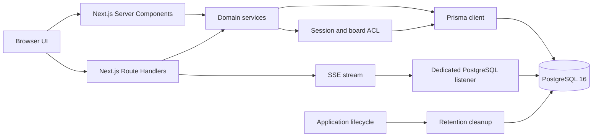
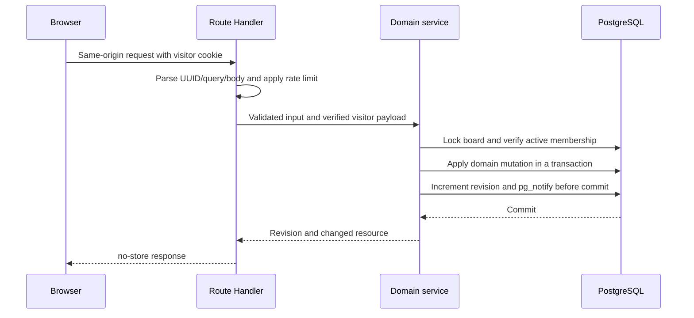

[English](architecture.md) | [Русский](ru/architecture.md) | [Español](es/architecture.md)

# Architecture

Badaction is an accountless retrospective board built as a single Next.js application backed by PostgreSQL. The browser receives the initial board snapshot from a Server Component, performs changes through Route Handlers, and keeps the view current through Server-Sent Events (SSE) plus periodic reconciliation.

"Accountless" is not the same as absolutely anonymous. The application has no registered user accounts, email addresses, or passwords, but board content, display names, optional author and assignee fields, network metadata handled by the deployment, and browser credentials can still identify or correlate people.

## System boundaries

The main layers are:

- **UI:** React Server Components render the board's initial state. Client components handle interactions, optimistic presentation, pagination, drag-and-drop, and realtime refreshes.
- **HTTP boundary:** Next.js App Router pages and Route Handlers parse inputs, enforce request-level security and rate limits, and translate errors into safe HTTP responses.
- **Domain services:** services implement board, column, card, group, action-item, voting, export, and access rules. Mutations that touch related records run in database transactions.
- **Access control:** a signed browser credential resolves to an anonymous session. An active membership connects that session to a board with either the `OWNER` or `PARTICIPANT` role.
- **Persistence:** Prisma handles normal reads and writes. Carefully scoped SQL is used where PostgreSQL locking, constraints, `LISTEN`/`NOTIFY`, advisory locks, or bounded deletion are required.
- **Process lifecycle:** the Node.js process starts retention cleanup, drains on shutdown, and closes long-lived PostgreSQL resources.

Route Handlers call services rather than embedding domain queries. The board Server Component also calls the query service directly; it does not make an HTTP request back into the application.

## Data model

The active schema is defined by `prisma/schema.prisma` and the SQL migrations in `prisma/migrations/`.

| Entity                 | Purpose                                                                                                         |
| ---------------------- | --------------------------------------------------------------------------------------------------------------- |
| `Board`                | Title, feature settings, read-only state, monotonic revision, creation time, and expiry time.                   |
| `BoardColumn`          | Ordered, owner-managed columns with a per-identity vote limit from 0 to 20.                                     |
| `Card`                 | Retrospective text, optional author, creator membership, column and group placement, and timestamps.            |
| `CardGroup`            | An owner-managed collection of cards in one column, with a primary card and optional title.                     |
| `ActionItem`           | Ordered follow-up work with text, optional assignee, completion state, and optional source card.                |
| `Vote`                 | One vote by a board-scoped visitor identity on a card, assigned to a quota slot in that column.                 |
| `AnonymousSession`     | Server-side record for a browser credential. The credential is stored as an HMAC-derived hash, not in raw form. |
| `BoardMembership`      | The link between a session and a board, including role, display name, and revocation state.                     |
| `BoardInvitation`      | Expiring and revocable invitation metadata. Only an HMAC hash of the invitation token is stored.                |
| `InvitationRedemption` | Auditable link between an invitation, session, and membership redemption.                                       |
| `RateLimitBucket`      | Shared PostgreSQL-backed abuse-control counters and expiry times.                                               |

Database constraints bind cards, groups, votes, columns, memberships, and invitations to the same board. Unique indexes enforce one active owner, one active membership per board/session, one vote per card/visitor, and vote quota slots. Some of these guarantees depend on the SQL migrations in addition to the Prisma schema.

Group presentation is derived without duplicating persisted card data. A missing group title falls back to the primary card text. The aggregate group vote count is computed with `COUNT(DISTINCT visitor_token)` across votes on every card in the group. Creating an action item from a group copies this effective title and uses the primary card for the existing optional source-card relationship.

## Identity and access

Creating a board atomically creates or resolves the anonymous session, creates the board, creates its single active owner membership, and creates the default columns. The board UUID appears in the URL, but it is only a locator. It does not grant access.

Every protected board read, mutation, export, and event stream requires all of the following:

1. a valid signed `visitor_token` cookie;
2. an active, unexpired anonymous session for that credential;
3. an active membership for the requested board; and
4. an unexpired board.

Missing or revoked membership is returned as `404 BOARD_NOT_FOUND`, so callers cannot use board UUIDs to distinguish a private board from a nonexistent one. Owner-only operations perform an additional role check. Participants can create cards and manage cards created by their current membership; owners can manage the board structure, groups, action items, settings, participants, invitations, vote resets, and deletion.

Invitation URLs use `/join#token`. The fragment keeps the raw token out of the initial HTTP request, but the token remains a bearer credential until it expires, is revoked, or reaches its use limit. Redemption sends the token in a same-origin JSON request and creates the membership transactionally. Invitation list responses never return the raw token again.

Deleting the browser cookie loses the local access identity. A board UUID by itself does not recover membership. See [Security and privacy](security-and-privacy.md) for the trust model and operator guidance.

## Request and mutation flow

User input is validated at the HTTP boundary with Zod and checked again where services enforce business invariants. Board-scoped mutations lock the board before changing state. Ordering and destructive operations use a decimal-string `expectedRevision`; a stale client receives `409 STALE_BOARD_REVISION` with the current revision instead of silently overwriting newer state.

The mutation and its `pg_notify` call share the same transaction. PostgreSQL therefore exposes an invalidation only after the state change commits, and emits nothing for a rolled-back change. More details about the browser-facing endpoints are in [API](api.md).

## Reads and pagination

The board page is dynamic and is initially loaded on the server after the same session and membership checks used by the API. The snapshot includes settings, viewer capabilities, ordered columns, the first item page for every column, remaining votes, and all action items.

Additional column items are fetched with an opaque cursor. Cursors encode the top-level card-or-group position and identity; callers must treat them as opaque. Reads use repeatable-read transactions so a snapshot or page is internally consistent. The client merges additional pages while the current board revision remains authoritative.

## Realtime flow

SSE is an invalidation channel, not a data replication protocol:

1. A mutation increments `Board.revision` and publishes `{boardId, revision, type}` with PostgreSQL `NOTIFY` in the same transaction.
2. Each application process that serves streams maintains one lazily opened PostgreSQL `LISTEN` connection and fans relevant events out to its local clients.
3. `/api/boards/{boardId}/events` verifies access before and after listener subscription, then sends `board.ready` or `board.invalidate` events.
4. The browser fetches an authoritative board snapshot after an invalidation. Event data is never treated as the board state itself.
5. A 12-second heartbeat keeps the connection active. The server revalidates access every 30 seconds and closes the stream if access is lost.
6. The browser reconnects with `Last-Event-ID`, reconciles every 30 seconds even while connected, and falls back to polling when the SSE protocol or rate limit prevents continued streaming.

The stream response disables caching and transformation and sets `X-Accel-Buffering: no`. A reverse proxy must still preserve streaming, disable response buffering and compression for this route, and use an idle timeout comfortably above the heartbeat interval.

## Retention flow

Each board receives an immutable `expiresAt` when it is created. `BOARD_RETENTION_DAYS` controls new boards only and is constrained to 1–365 days. An expired board becomes inaccessible immediately because access and query paths compare its expiry with the current time.

When embedded cleanup is enabled, the application starts a run on process startup and then at the configured interval. Cleanup:

- removes expired rate-limit buckets;
- selects expired boards in bounded batches;
- removes large child sets in bounded chunks before deleting each parent board; and
- removes expired anonymous sessions only after they no longer reference memberships or created invitations.

A session-level PostgreSQL advisory lock allows only one cleanup worker to run at a time. A shared database marker enforces the minimum interval across application replicas. Failure to clean one parent or one data class is recorded without rolling back unrelated completed work; later runs continue the job.

## Health and shutdown

`GET /api/health` returns `200 {"status":"ok"}` only when runtime configuration validates, the process is not draining, and PostgreSQL answers `SELECT 1` within 1.5 seconds. It returns `503 {"status":"unavailable"}` otherwise.

This is a liveness/readiness signal, not a complete diagnostic. It does not verify that migrations are current, the SSE listener can hold a session, retention cleanup is succeeding, or backups are usable. Those conditions require separate deployment checks and monitoring.

The production entrypoint supervises Next.js and handles graceful termination. During shutdown the process marks itself as draining, aborts cleanup, closes the PostgreSQL listener, and gives in-flight work a bounded period to finish. Orchestrators should send `SIGTERM`, stop routing new traffic after health becomes unavailable, and allow the configured grace period before forcing termination.

## Multiple replicas and connection pooling

Multiple application replicas can share one PostgreSQL database:

- mutations and rate-limit counters are coordinated in PostgreSQL;
- every process has its own `LISTEN` connection and receives committed notifications;
- every process has a local SSE fan-out and local concurrent-stream counter; and
- retention runs are serialized across replicas by the advisory lock and schedule marker.

Capacity planning must include the Prisma connection pool for every replica, one long-lived listener connection for every process that has opened an SSE stream, and one temporary dedicated cleanup connection while a cleanup attempt runs.

The realtime listener and retention advisory lock require session semantics. Do not route their `DATABASE_URL` through a transaction-only pooler: `LISTEN` state and session advisory locks would not remain attached to the application process. Use a direct PostgreSQL connection or a session-mode pool endpoint, reserve sufficient connections, and verify reconnect behavior before scaling replicas.

The application assumes the schema selected by `DATABASE_URL` is where the migrations were applied. The supplied configuration uses the `public` schema; non-default search-path arrangements are not a documented deployment mode.

## Architectural constraints

- PostgreSQL is authoritative for access, revisions, votes, quotas, and retained data. Browser storage is not an authorization source.
- There is no registered-account recovery path. Credential loss normally means access loss.
- Realtime delivery is best-effort invalidation. Snapshot reads and periodic reconciliation provide convergence.
- API, service, and migration versions must be deployed together. Database migrations are forward-only, and mixed application versions can violate access or constraint assumptions.
- The application does not provide end-to-end encryption. The database and host operator can access stored content.
