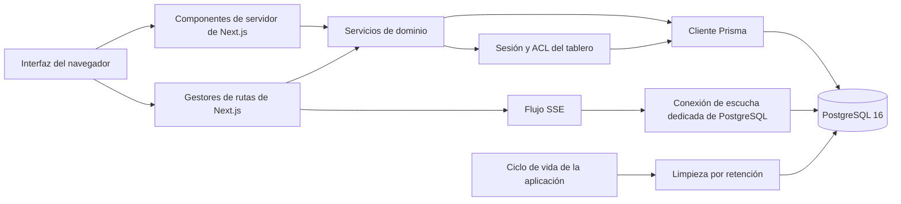

[English](../architecture.md) | [Русский](../ru/architecture.md) | [Español](architecture.md)

# Arquitectura

Badaction es un tablero de retrospectivas sin cuentas construido como una única
aplicación Next.js respaldada por PostgreSQL. El navegador recibe la instantánea
inicial del tablero desde un componente de servidor, realiza cambios mediante
gestores de rutas y mantiene la vista actualizada mediante Server-Sent Events
(SSE) y conciliación periódica.

«Sin cuentas» no equivale a absolutamente anónimo. La aplicación no tiene
cuentas de usuario registradas, direcciones de correo electrónico ni
contraseñas, pero el contenido de los tableros, los nombres visibles, los campos
opcionales de autor y responsable, los metadatos de red que gestione el
despliegue y las credenciales del navegador aún pueden identificar o
correlacionar personas.

## Límites del sistema



Las capas principales son:

- **Interfaz:** los componentes de servidor de React renderizan el estado inicial del tablero.
  Los componentes cliente gestionan las interacciones, la presentación
  optimista, la paginación, el arrastrar y soltar y las actualizaciones en tiempo
  real.
- **Límite HTTP:** las páginas y los gestores de rutas de Next.js App Router analizan
  las entradas, aplican la seguridad y los límites de frecuencia de las
  solicitudes, y convierten los errores en respuestas HTTP seguras.
- **Servicios de dominio:** los servicios implementan las reglas de tableros,
  columnas, tarjetas, grupos, elementos de acción, votos, exportación y acceso.
  Las mutaciones que afectan a registros relacionados se ejecutan en
  transacciones de base de datos.
- **Control de acceso:** una credencial firmada del navegador se resuelve como
  una sesión anónima. Una membresía activa conecta esa sesión con un tablero y
  le asigna el rol `OWNER` o `PARTICIPANT`.
- **Persistencia:** Prisma gestiona las lecturas y escrituras normales. Se usa
  SQL cuidadosamente acotado cuando se requieren bloqueos o restricciones de
  PostgreSQL, `LISTEN`/`NOTIFY`, bloqueos consultivos o eliminación por lotes
  limitados.
- **Ciclo de vida del proceso:** el proceso Node.js inicia la limpieza de
  retención, deja de aceptar tráfico durante el apagado y cierra los recursos de
  PostgreSQL de larga duración.

Los gestores de rutas llaman a servicios en lugar de incluir consultas de dominio.
El componente de servidor del tablero también llama directamente al servicio de
consulta; no realiza una solicitud HTTP de vuelta a la aplicación.

## Modelo de datos

El esquema activo se define en `prisma/schema.prisma` y en las migraciones SQL
de `prisma/migrations/`.

| Entidad                | Propósito                                                                                                                        |
| ---------------------- | -------------------------------------------------------------------------------------------------------------------------------- |
| `Board`                | Título, ajustes de funciones, estado de solo lectura, revisión monotónica, hora de creación y hora de caducidad.                 |
| `BoardColumn`          | Columnas ordenadas y gestionadas por el propietario, con un límite de votos por identidad de 0 a 20.                             |
| `Card`                 | Texto de retrospectiva, autor opcional, membresía creadora, posición en columna y grupo, y marcas de tiempo.                     |
| `CardGroup`            | Colección de tarjetas gestionada por el propietario dentro de una columna, con tarjeta principal y título opcional.              |
| `ActionItem`           | Trabajo de seguimiento ordenado, con texto, responsable opcional, estado de finalización y tarjeta de origen opcional.           |
| `Vote`                 | Un voto de una identidad de visitante acotada al tablero sobre una tarjeta, asignado a una plaza de cuota de esa columna.        |
| `AnonymousSession`     | Registro de servidor para una credencial del navegador. La credencial se almacena como hash derivado mediante HMAC, no en bruto. |
| `BoardMembership`      | Vínculo entre una sesión y un tablero, incluidos el rol, el nombre visible y el estado de revocación.                            |
| `BoardInvitation`      | Metadatos de invitación con caducidad y revocación. Solo se almacena un hash HMAC del token de invitación.                       |
| `InvitationRedemption` | Vínculo auditable entre el canje de una invitación, una sesión y una membresía.                                                  |
| `RateLimitBucket`      | Contadores de control de abuso respaldados y compartidos por PostgreSQL, con sus horas de caducidad.                             |

Las restricciones de la base de datos vinculan tarjetas, grupos, votos,
columnas, membresías e invitaciones al mismo tablero. Los índices únicos
garantizan un propietario activo, una membresía activa por tablero/sesión, un
voto por tarjeta/visitante y las plazas de cuota de voto. Algunas de estas
garantías dependen de las migraciones SQL además del esquema de Prisma.

## Identidad y acceso

La creación de un tablero crea o resuelve atómicamente la sesión anónima, crea
el tablero, crea su única membresía de propietario activa y crea las columnas
predeterminadas. El UUID del tablero aparece en la URL, pero es solo una dirección.
No concede acceso.

Cada lectura protegida, mutación, exportación y flujo de eventos de un tablero
requiere todo lo siguiente:

1. una cookie `visitor_token` firmada y válida;
2. una sesión anónima activa y no caducada para esa credencial;
3. una membresía activa para el tablero solicitado; y
4. un tablero que no haya caducado.

Una membresía ausente o revocada se devuelve como `404 BOARD_NOT_FOUND`, de modo
que quien llama no puede usar UUID de tableros para distinguir un tablero
privado de uno inexistente. Las operaciones exclusivas del propietario realizan
una comprobación de rol adicional. Los participantes pueden crear tarjetas y
gestionar las que haya creado su membresía actual; los propietarios pueden
gestionar la estructura del tablero, los grupos, los elementos de acción, los
ajustes, los participantes, las invitaciones, el restablecimiento de votos y la
eliminación.

Las URL de invitación usan `/join#token`. El fragmento evita que el token en
bruto forme parte de la solicitud HTTP inicial, pero el token sigue siendo una
credencial al portador hasta que caduca, se revoca o alcanza su límite de usos. El
canje envía el token en una solicitud JSON al mismo origen y crea la membresía
de forma transaccional. Las respuestas que enumeran invitaciones nunca vuelven
a devolver el token en bruto.

Eliminar la cookie del navegador hace perder la identidad de acceso local. Un
UUID de tablero no permite por sí solo recuperar una membresía. Consulta
[Seguridad y privacidad](security-and-privacy.md) para conocer el modelo de
confianza y las indicaciones para operadores.

## Flujo de solicitudes y mutaciones

```mermaid
sequenceDiagram
  participant B as Navegador
  participant R as Gestor de rutas
  participant S as Servicio de dominio
  participant P as PostgreSQL

  B->>R: Solicitud del mismo origen con cookie de visitante
  R->>R: Analizar UUID, consulta y cuerpo; aplicar límite de frecuencia
  R->>S: Entrada validada y datos de visitante verificados
  S->>P: Bloquear tablero y verificar membresía activa
  S->>P: Aplicar mutación de dominio en una transacción
  S->>P: Incrementar revisión y ejecutar pg_notify antes de confirmar
  P-->>S: Confirmar transacción
  S-->>R: Revisión y recurso modificado
  R-->>B: Respuesta no almacenable en caché
```

La entrada del usuario se valida con Zod en el límite HTTP y vuelve a
comprobarse donde los servicios aplican los invariantes de negocio. Las
mutaciones acotadas a un tablero bloquean el tablero antes de cambiar el estado.
Las operaciones de ordenación y destructivas usan un `expectedRevision` en
forma de cadena decimal; un cliente obsoleto recibe
`409 STALE_BOARD_REVISION` con la revisión actual en lugar de sobrescribir en
silencio un estado más reciente.

La mutación y su llamada a `pg_notify` comparten la misma transacción. Por ello,
PostgreSQL solo expone una invalidación después de confirmar el cambio de estado
y no emite nada si la transacción se revierte. Hay más detalles sobre los
rutas orientadas al navegador en [API](api.md).

## Lecturas y paginación

La página del tablero es dinámica y se carga inicialmente en el servidor
después de aplicar las mismas comprobaciones de sesión y membresía que usa la
API. La instantánea incluye ajustes, capacidades de quien consulta, columnas
ordenadas, la primera página de elementos de cada columna, los votos restantes
y todos los elementos de acción.

Los elementos adicionales de una columna se obtienen con un cursor opaco. Los
cursores codifican la posición e identidad de la tarjeta o grupo de nivel
superior; quien llama debe tratarlos como opacos. Las lecturas usan transacciones
con aislamiento `REPEATABLE READ` para que una instantánea o una página sea
internamente coherente. El cliente combina páginas adicionales mientras la
revisión actual del tablero sigue siendo autoritativa.

## Flujo en tiempo real

SSE es un canal de invalidación, no un protocolo de replicación de datos:

1. Una mutación incrementa `Board.revision` y publica
   `{boardId, revision, type}` con `NOTIFY` de PostgreSQL en la misma transacción.
2. Cada proceso de la aplicación que sirve flujos mantiene una conexión
   `LISTEN` de PostgreSQL que se abre bajo demanda y distribuye los eventos
   pertinentes a sus clientes locales.
3. `/api/boards/{boardId}/events` verifica el acceso antes y después de
   suscribirse a la conexión de escucha y luego envía eventos `board.ready` o
   `board.invalidate`.
4. El navegador obtiene una instantánea autoritativa del tablero después de una
   invalidación. Los datos del evento nunca se tratan como el propio estado del
   tablero.
5. Una señal de mantenimiento cada 12 segundos mantiene activa la conexión. El
   servidor vuelve a validar el acceso cada 30 segundos y cierra el flujo si se pierde el
   acceso.
6. El navegador se reconecta con `Last-Event-ID`, concilia cada 30 segundos
   incluso mientras está conectado y recurre a consultas periódicas cuando el
   protocolo SSE o el límite de frecuencia impiden mantener el flujo.

La respuesta del flujo desactiva el caché y las transformaciones, y establece
`X-Accel-Buffering: no`. Aun así, un proxy inverso debe conservar la transmisión,
desactivar el almacenamiento en búfer de respuestas y la compresión para esta
ruta, y usar un tiempo de espera por inactividad holgadamente superior al
intervalo de la señal de mantenimiento.

## Flujo de retención

Cada tablero recibe un `expiresAt` inmutable al crearse.
`BOARD_RETENTION_DAYS` solo controla los tableros nuevos y está restringido a
1–365 días. Un tablero caducado deja de ser accesible de inmediato porque las
rutas de acceso y consulta comparan su caducidad con la hora actual.

Cuando la limpieza integrada está habilitada, la aplicación inicia una
ejecución al arrancar el proceso y después en el intervalo configurado. La
limpieza:

- elimina registros de limitación de frecuencia caducados;
- selecciona tableros caducados en lotes acotados;
- elimina conjuntos grandes de filas dependientes en bloques acotados antes de
  eliminar cada tablero padre; y
- elimina sesiones anónimas caducadas solo cuando ya no hacen referencia a
  membresías o invitaciones creadas.

Un bloqueo consultivo de PostgreSQL a nivel de sesión permite que solo se ejecute
un proceso de limpieza a la vez. Un marcador compartido en la base de datos
aplica el intervalo mínimo entre réplicas de la aplicación. El fallo al limpiar
un padre o una clase de datos se registra sin revertir el trabajo no relacionado
que ya se haya completado; las ejecuciones posteriores continúan el trabajo.

## Estado y apagado

`GET /api/health` devuelve `200 {"status":"ok"}` solo cuando la configuración
del entorno de ejecución es válida, el proceso acepta tráfico y PostgreSQL
responde a `SELECT 1` en 1,5 segundos. En caso contrario devuelve
`503 {"status":"unavailable"}`.

Es una señal de actividad y disponibilidad, no un diagnóstico completo. No
verifica que las migraciones estén al día, que la conexión de escucha SSE pueda
mantener una sesión,
que la limpieza de retención tenga éxito ni que las copias de seguridad sean
utilizables. Esas condiciones requieren comprobaciones y supervisión separadas
del despliegue.

El punto de entrada de producción supervisa Next.js y gestiona la terminación
ordenada. Durante el apagado, el proceso deja de aceptar tráfico, interrumpe la
limpieza, cierra la conexión de escucha de PostgreSQL y concede un período acotado para que
termine el trabajo en curso. Los orquestadores deben enviar `SIGTERM`, dejar de
dirigir tráfico nuevo cuando la comprobación de estado deje de estar disponible y respetar el
período de gracia configurado antes de forzar la terminación.

## Varias réplicas y agrupación de conexiones

Varias réplicas de la aplicación pueden compartir una base de datos PostgreSQL:

- las mutaciones y los contadores de limitación de frecuencia se coordinan en
  PostgreSQL;
- cada proceso tiene su propia conexión `LISTEN` y recibe las notificaciones
  confirmadas;
- cada proceso tiene una distribución SSE y un contador de flujos simultáneos
  locales; y
- las ejecuciones de retención se serializan entre réplicas mediante el bloqueo
  consultivo y el marcador de programación.

La planificación de capacidad debe incluir el grupo de conexiones de Prisma de
cada réplica, una conexión de escucha de larga duración por cada proceso que
haya abierto un flujo SSE y una conexión temporal dedicada a la limpieza
mientras se ejecuta un intento.

La conexión de escucha en tiempo real y el bloqueo consultivo de retención
requieren semántica de sesión. No enrutes su `DATABASE_URL` a través de un
agrupador solo por transacción: el estado de `LISTEN` y los bloqueos consultivos de sesión no
permanecerían asociados al proceso de la aplicación. Usa una conexión directa a
PostgreSQL o un punto de conexión agrupada en modo sesión, reserva suficientes conexiones
y verifica el comportamiento de reconexión antes de ampliar el número de
réplicas.

La aplicación presupone que el esquema seleccionado por `DATABASE_URL` es aquel
en el que se aplicaron las migraciones. La configuración proporcionada usa el
esquema `public`; los diseños con una ruta de búsqueda no predeterminada no forman
parte de los modos de despliegue documentados.

## Restricciones arquitectónicas

- PostgreSQL es autoritativo para el acceso, las revisiones, los votos, las
  cuotas y los datos retenidos. El almacenamiento del navegador no es una fuente
  de autorización.
- No existe una ruta de recuperación mediante una cuenta registrada. Perder la
  credencial normalmente significa perder el acceso.
- La entrega en tiempo real es una invalidación de mejor esfuerzo. Las lecturas
  de instantáneas y la conciliación periódica proporcionan convergencia.
- Las versiones de API, servicios y migraciones deben desplegarse juntas. Las
  migraciones de base de datos son progresivas y mezclar versiones de la
  aplicación puede infringir las suposiciones de acceso o restricciones.
- La aplicación no proporciona cifrado de extremo a extremo. La base de datos y
  el operador del host pueden acceder al contenido almacenado.
