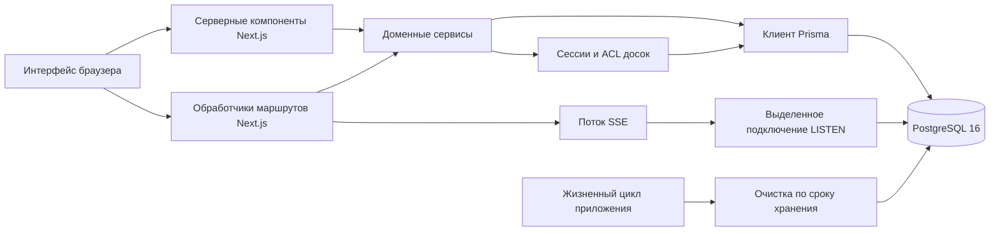

[English](../architecture.md) | [Русский](architecture.md) | [Español](../es/architecture.md)

# Архитектура

Badaction — доска ретроспектив без учётных записей, реализованная как единое
приложение Next.js с PostgreSQL. Браузер получает начальный снимок состояния
доски от серверного компонента, выполняет изменения через обработчики маршрутов
и поддерживает актуальность представления через SSE и периодическую сверку.

«Без учётных записей» не означает абсолютную анонимность. В приложении нет
зарегистрированных пользовательских аккаунтов, адресов электронной почты или
паролей, но содержимое досок, отображаемые имена, необязательные поля автора и
исполнителя, обрабатываемые при развёртывании сетевые метаданные и реквизиты
доступа браузера всё равно могут идентифицировать людей или связывать их
действия.

## Границы системы



Основные слои:

- **Интерфейс:** серверные компоненты React отрисовывают начальное состояние доски.
  Клиентские компоненты отвечают за взаимодействия, оптимистичное отображение,
  пагинацию, перетаскивание и обновления в реальном времени.
- **HTTP-граница:** страницы Next.js App Router и обработчики маршрутов разбирают
  входные данные, применяют защиту уровня запроса и ограничения частоты и
  преобразуют ошибки в безопасные HTTP-ответы.
- **Доменные сервисы:** сервисы реализуют правила досок, колонок, карточек,
  групп, задач, голосования, экспорта и доступа. Мутации нескольких связанных
  записей выполняются в транзакциях базы данных.
- **Контроль доступа:** подписанный реквизит браузера сопоставляется с анонимной
  сессией. Активное членство связывает эту сессию с доской в роли `OWNER` или
  `PARTICIPANT`.
- **Хранение:** Prisma обрабатывает обычные чтения и записи. Точечно применяемый
  SQL используется там, где нужны блокировки и ограничения PostgreSQL,
  `LISTEN`/`NOTIFY`, рекомендательные блокировки или порционное удаление.
- **Жизненный цикл процесса:** Node.js-процесс запускает очистку по сроку
  хранения, при завершении прекращает принимать трафик и закрывает
  долгоживущие ресурсы PostgreSQL.

Обработчики маршрутов вызывают сервисы, а не встраивают в себя доменные запросы.
Серверный компонент доски также напрямую вызывает сервис чтения и не выполняет
внутренний HTTP-запрос к приложению.

## Модель данных

Действующая схема определена в `prisma/schema.prisma` и SQL-миграциях из
`prisma/migrations/`.

| Сущность               | Назначение                                                                                                                          |
| ---------------------- | ----------------------------------------------------------------------------------------------------------------------------------- |
| `Board`                | Название, настройки функций, режим только для чтения, монотонная ревизия, время создания и истечения срока действия.                |
| `BoardColumn`          | Упорядоченные управляемые владельцем колонки с лимитом голосов на идентификатор от 0 до 20.                                         |
| `Card`                 | Текст ретроспективы, необязательный автор, членство создателя, положение в колонке и группе и временные метки.                      |
| `CardGroup`            | Управляемая владельцем группа карточек одной колонки с основной карточкой и необязательным названием.                               |
| `ActionItem`           | Упорядоченная последующая задача с текстом, необязательным исполнителем, состоянием выполнения и необязательной исходной карточкой. |
| `Vote`                 | Голос производного идентификатора посетителя в рамках доски за карточку, занимающий слот квоты в соответствующей колонке.           |
| `AnonymousSession`     | Серверная запись реквизита браузера. Реквизит хранится как производный HMAC-хеш, а не в исходном виде.                              |
| `BoardMembership`      | Связь сессии и доски, включающая роль, отображаемое имя и состояние отзыва.                                                         |
| `BoardInvitation`      | Метаданные отзываемого приглашения со сроком действия. Хранится только HMAC-хеш токена приглашения.                                 |
| `InvitationRedemption` | Аудируемая связь между приглашением, сессией и погашением членства.                                                                 |
| `RateLimitBucket`      | Общие счётчики защиты от злоупотреблений в PostgreSQL и время их сброса.                                                            |

Ограничения базы связывают карточки, группы, голоса, колонки, членства и
приглашения с одной и той же доской. Уникальные индексы обеспечивают одного
активного владельца, одно активное членство на пару доска/сессия, один голос на
пару карточка/посетитель и слоты квоты голосования. Часть этих гарантий зависит
от SQL-миграций в дополнение к схеме Prisma.

## Идентичность и доступ

Создание доски атомарно создаёт либо находит анонимную сессию, создаёт доску, её
единственное активное членство `OWNER` и стандартные колонки. UUID доски
находится в URL, но служит только адресом и не предоставляет доступ.

Для каждого защищённого чтения доски, мутации, экспорта и потока событий нужны:

1. допустимая подписанная cookie `visitor_token`;
2. активная неистёкшая анонимная сессия этого реквизита;
3. активное членство в запрошенной доске; и
4. неистёкшая доска.

Отсутствующее или отозванное членство возвращается как
`404 BOARD_NOT_FOUND`, поэтому по UUID нельзя отличить закрытую доску от
несуществующей. Операции владельца дополнительно проверяют роль. Участники могут
создавать карточки и управлять карточками, созданными их текущим членством;
владельцы управляют структурой доски, группами, задачами, настройками,
участниками, приглашениями, сбросом голосов и удалением.

URL приглашений имеют вид `/join#token`. Фрагмент не даёт исходному токену
попасть в первый HTTP-запрос, но до истечения срока, отзыва или исчерпания лимита
использований токен остаётся предъявляемым реквизитом доступа. При погашении
токен отправляется в JSON-запросе с того же источника, а членство создаётся
транзакционно. Ответы со списком приглашений никогда не возвращают исходный
токен повторно.

Удаление cookie браузера приводит к потере локальной идентичности доступа. Один
UUID доски не восстанавливает членство. Модель доверия и рекомендации операторам
описаны в [Безопасности и приватности](security-and-privacy.md).

## Поток запроса и мутации

```mermaid
sequenceDiagram
  participant B as Браузер
  participant R as Обработчик маршрута
  participant S as Доменный сервис
  participant P as PostgreSQL

  B->>R: Запрос с того же источника и cookie посетителя
  R->>R: Разобрать UUID, параметры и тело; применить ограничение частоты
  R->>S: Проверенные входные данные и идентификатор посетителя
  S->>P: Заблокировать доску и проверить активное членство
  S->>P: Выполнить доменную мутацию в транзакции
  S->>P: Увеличить ревизию и вызвать pg_notify до фиксации
  P-->>S: Зафиксировать транзакцию
  S-->>R: Вернуть ревизию и изменённый ресурс
  R-->>B: Вернуть некешируемый ответ
```

Пользовательский ввод проверяется на HTTP-границе через Zod и повторно там, где
сервисы обеспечивают бизнес-инварианты. Мутации в рамках доски блокируют доску
до изменения состояния. Для упорядочивания и разрушительных операций
используется `expectedRevision` в виде десятичной строки; устаревший клиент
получает `409 STALE_BOARD_REVISION` с текущей ревизией вместо незаметной
перезаписи нового состояния.

Мутация и её вызов `pg_notify` находятся в одной транзакции. Поэтому PostgreSQL
публикует уведомление об изменении только после фиксации состояния и ничего не
публикует при откате. Конечные точки веб-приложения подробнее описаны в
[API](api.md).

## Чтение и пагинация

Страница доски динамическая и первоначально загружается на сервере после тех же
проверок сессии и членства, что и API. Снимок включает настройки, доступные
просматривающему пользователю действия, упорядоченные колонки, первую страницу
элементов каждой колонки, оставшиеся голоса и все задачи.

Дополнительные элементы колонки загружаются с непрозрачным курсором. Он кодирует
положение и идентичность верхнеуровневой карточки или группы; клиенты не должны
интерпретировать его содержимое. Чтения выполняются в транзакциях с уровнем
изоляции `REPEATABLE READ`, поэтому снимок или страница внутренне согласованы.
Клиент объединяет дополнительные страницы, пока текущая ревизия доски остаётся
авторитетной.

## Обновления в реальном времени

SSE — канал уведомлений об изменениях, а не протокол репликации данных:

1. Мутация увеличивает `Board.revision` и в той же транзакции публикует через
   PostgreSQL `NOTIFY` объект `{boardId, revision, type}`.
2. Каждый процесс приложения, обслуживающий потоки, поддерживает одно лениво
   открываемое PostgreSQL-подключение `LISTEN` и распределяет относящиеся к доске
   события локальным клиентам.
3. `/api/boards/{boardId}/events` проверяет доступ до и после подписки
   подключения, затем отправляет события `board.ready` или `board.invalidate`.
4. После уведомления браузер загружает авторитетный снимок доски. Данные события
   никогда не считаются самим состоянием доски.
5. Служебное сообщение раз в 12 секунд поддерживает соединение.
   Сервер повторно проверяет доступ каждые 30 секунд и закрывает поток при его
   потере.
6. Браузер переподключается с `Last-Event-ID`, выполняет сверку каждые 30 секунд
   даже при активном соединении и переключается на периодические запросы, если
   протокол SSE или ограничение частоты не позволяет продолжать потоковую
   передачу.

Ответ потока запрещает кеширование и преобразование и задаёт
`X-Accel-Buffering: no`. Обратный прокси-сервер всё равно должен сохранять
потоковую передачу, отключать буферизацию и сжатие ответа для этого маршрута и
использовать тайм-аут бездействия, заметно превышающий интервал служебных
сообщений.

## Очистка по сроку хранения

При создании каждая доска получает неизменяемый `expiresAt`.
`BOARD_RETENTION_DAYS` управляет только новыми досками и ограничен диапазоном
1–365 дней. Доступ к истёкшей доске прекращается немедленно, поскольку пути
доступа и запросы сравнивают срок с текущим временем.

Если встроенная очистка включена, приложение запускает проход при старте
процесса, а затем с заданным интервалом. Очистка:

- удаляет истёкшие корзины ограничения частоты;
- выбирает истёкшие доски ограниченными пакетами;
- удаляет крупные наборы дочерних записей ограниченными порциями до удаления
  каждой родительской доски; и
- удаляет истёкшие анонимные сессии только после исчезновения ссылок на членства
  или созданные приглашения.

Сеансовая рекомендательная блокировка PostgreSQL разрешает одновременно
работать только одному процессу очистки. Общая метка в базе обеспечивает
минимальный интервал между запусками на разных репликах приложения. Ошибка
очистки одной родительской записи или одного класса данных регистрируется, не
откатывая завершённую независимую работу; следующие проходы продолжают задачу.

## Проверка работоспособности и завершение

`GET /api/health` возвращает `200 {"status":"ok"}` только при допустимой
конфигурации среды выполнения, если процесс принимает трафик и PostgreSQL
отвечает на `SELECT 1` в течение 1,5 секунды. Иначе маршрут возвращает
`503 {"status":"unavailable"}`.

Это сигнал жизнеспособности и готовности, а не полная диагностика. Он не
проверяет актуальность миграций, способность SSE-слушателя удерживать сессию,
успешность очистки по сроку хранения или пригодность резервных копий. Эти
условия требуют отдельных проверок развёртывания и мониторинга.

Точка входа production-контейнера контролирует Next.js и обрабатывает корректное
завершение. После сигнала завершения процесс перестаёт принимать новый трафик,
отменяет очистку, закрывает слушатель PostgreSQL и оставляет ограниченное время
на завершение текущей работы. Оркестратор должен отправлять `SIGTERM`, прекращать
новый трафик после того, как проверка работоспособности вернула `unavailable`, и
выдерживать настроенный льготный период перед принудительным завершением.

## Несколько реплик и пулы подключений

Несколько реплик приложения могут использовать одну базу PostgreSQL:

- мутации и счётчики ограничения частоты координируются в PostgreSQL;
- у каждого процесса есть собственное подключение `LISTEN`, которое получает
  уведомления после фиксации транзакций;
- у каждого процесса есть собственная локальная рассылка SSE и локальный
  счётчик одновременных потоков; и
- запуски очистки по сроку хранения сериализуются между репликами через
  рекомендательную блокировку и общую метку расписания.

При планировании ёмкости учитывайте пул подключений Prisma каждой реплики, одно
долгоживущее подключение слушателя для каждого процесса, открывавшего поток SSE,
и одно временное выделенное подключение очистки во время прохода.

Слушатель обновлений и рекомендательная блокировка очистки требуют семантики
сеанса. Не направляйте их `DATABASE_URL` через пулер только для транзакций:
состояние `LISTEN` и сеансовые рекомендательные блокировки перестанут быть
привязаны к процессу приложения. Используйте прямое подключение к PostgreSQL или
конечную точку пула в сеансовом режиме, резервируйте достаточно соединений и
проверяйте переподключение до масштабирования реплик.

Приложение предполагает, что выбранная в `DATABASE_URL` схема совпадает с той,
где применены миграции. Поставляемая конфигурация использует схему `public`;
нестандартный путь поиска схем не является документированным режимом
развёртывания.

## Архитектурные ограничения

- PostgreSQL является источником истины для доступа, ревизий, голосов, квот и
  хранимых данных. Хранилище браузера не является источником авторизации.
- Пути восстановления через зарегистрированную учётную запись нет. Потеря
  реквизита обычно означает потерю доступа.
- Доставка обновлений в реальном времени лишь уведомляет об изменениях без
  гарантии получения каждого сообщения. Чтение снимков и периодическая сверка
  обеспечивают сходимость.
- Версии API, сервисов и миграций должны развёртываться вместе. Миграции базы
  являются прямыми, а смешанные версии приложения могут нарушить предположения
  контроля доступа или ограничения базы данных.
- Приложение не предоставляет сквозного шифрования. Оператор базы и хоста имеет
  доступ к сохранённому содержимому.
